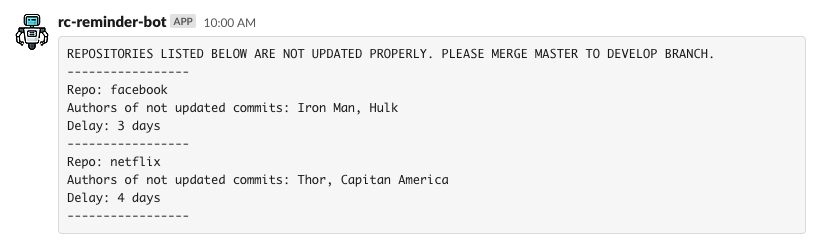

# rc-reminder-bot

## Description:

A simple bot that reminds forgetful developers of merging quick fixes from rc into develop branch

## Problem to solve:

When your company is following git-flow workflow ( or something similar ) you are familiar with quick-fix in the production branch. <br />
So when you are going to merge your fix into master ( or another branch ) then you should merge that change also to develop ( sooner or later ) <br />
If you will forget and someone overrides your changes then you got git conflicts ( which someone needs to solve ). <br />
When you are making a lot of deployments to production with a lot of minor fixes the problem is getting bigger, <br />
cause a lot of time you will be spending on resolving conflicts. <br />
I hope this bot will solve it, cause it will be reminding about that changes on a slack channel.

## How to use:

At first, we need to create a new workflow. <br />
So please create a file inside .github/workflows folder. <br />
For example: `.github/workflow/daily-job.yml` <br />
The file content should look similar to below example, but feel free to use own.

```
name: Daily job

on:
  schedule:
    # To set specific time please check https://crontab.guru
    - cron:  '0 6 * * *'

jobs:
  trigger:
    runs-on: ubuntu-latest

    steps:
      - name: Trigger script to send proper slack message
        uses: sztadii/rc-reminder-bot@1
        with:
          ORGANIZATION_NAME: 'facebook'
          BASE_BRANCH: develop
          HEAD_BRANCH: master

          # If our repo is public we can use already available GITHUB_TOKEN
          # GH_ACCESS_TOKEN: ${{ secrets.GITHUB_TOKEN }}

          # If is private we need to create own access token
          GH_ACCESS_TOKEN: ${{ secrets.GH_ACCESS_TOKEN }}

          SLACK_CHANNEL_WEBHOOK_URL: ${{ secrets.SLACK_CHANNEL_WEBHOOK_URL }}

          # To avoid too many notifications on slack channel we create below flag
          # If the flag is true then we will send the notification even if all repos are fine
          # But when flag is false then we will send the notification only if some repos need to be updated
          # Expected values [ true, false ]
          SEND_NOTIFICATION_EVEN_ALL_SUCCESS: true
```

## Expected result:

Once everything will be set up properly then you should see below message in the slack channel <br /> <br />


## How get SLACK_CHANNEL_WEBHOOK_URL

To get SLACK_CHANNEL_WEBHOOK_URL you need to create slack app, so please visit the [LINK](https://api.slack.com/apps?new_app=1). <br/>
When you will create it then you will need to click `Incoming Webhooks` link and active it. <br/>
Then you need to create a new hook by clicking `Add New Webhook to Workspace`. <br/>
After that you need to copy URL from sample curl. <br />
And should look similar to:

```
https://hooks.slack.com/services/aaa/bbb/ccc
```

## How get GH_ACCESS_TOKEN

To get GH_ACCESS_TOKEN we can use GITHUB_TOKEN env already available in secrets or create our own. <br/>
If our repo is private we cannot use GITHUB_TOKEN from github actions, so we need to create own token. <br/>
At first, you need visit the [LINK](https://github.com/settings/tokens). <br/>
Then you need to generate new token. <br/>
So you need to name it and give particular permissions. <br/>
In our case `repo` or `Full control of private repositories` will be enough. <br />
And should look similar to:

```
aaa-bbb-ccc-ddd-eee-fff
```

## Development / contribution requirements:

- NodeJS ( min 12.14.1 ) for app serving and other development process

### Before you will start

Please copy `.env.example` into `.env` file and fill with correct data <br />
In this way we will be able to run our script locally with real data. <br />

### How to run our application ( in development mode )

At first please install NodeJS on your machine, after that please run below commands:

```
npm ci
npm run start-dev
```

### How to run our application ( in production mode )

At first please install NodeJS on your machine, after that please run below commands:

```
npm ci
npm run start-prod
```
